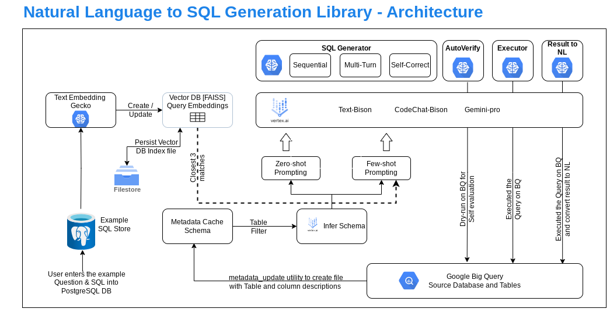
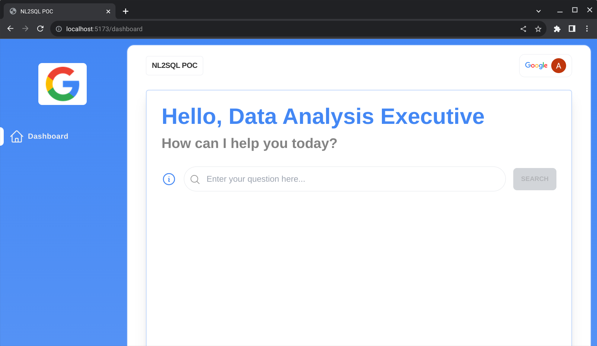

# NL2SQL Generic Library


## Introduction

NL2SQL Library allows you to interact with your databases/datasets in BQ by leveraging Vertex AI LLMs on Google Cloud. It helps generating SQL query statements from natural language questions.  Salient features of the library are

1. Filtering tables required to generate the SQL for a given natural language statement
2. Zero-shot or Few-shot prompting using vector embeddings and searching for closest matching queries
3. Multi-turn SQL generation while retaining the context of the original statement
4. Support for JOINs
5. Auto-verify generated SQL, execute and return results in natural language
6. Chat based web UI for interacting with the library

___

[Prerequisities](prerequisites.md)

[Modules and Descriptions](under_the_hood.md)

[Executing the Library code](deployment.md)

___

## Architecture



___

## Quick Start Guide

Refer [Quick Start Guide](QuickStart.md) for setting up and environment and start using NL2SQL library

___

## API Integration

### API Endpoints 

| API Endpoint   |      Description      |  Required Fields |
|-------------|:---------------------:|-------------------:|
| **/api/sqlgen** |is the end-point that is to be used to generate the SQL.  The natural lanaugage question is to be submitted to this endpoint via a **POST** Https method in Json format. |**question** |  
|**/api/display** | is used to display the latest question and the generated SQL for that question.  If there is an error in generaing the SQL for a given question, this API returns the SQL for the question if it exists in its list. Method = **GET**| - |
 |**/api/table/create** |is the end-point to create a table in the PostGreSql DB. Method = **POST**  |**table_name** | 
 | **/api/record/create**| is the end-point to insert rows into the PostgreSQL table.  The inserted rows are example questions and corresponding SQLs that can be retrieved using similarity analysis for few-shot prompting in SQL generation. Method = **POST** | **question**,  **sql**|

___

## Generating SQL from Natural statements using the NL2SQL library

Refer [Quick Start Guide](QuickStart.md) for setting up the environment to use the NL2SQL library

### 1. Using HTTP APIs

#### 1.1 Using PostMan client or other HTTP Clients

Steps to generate SQL
1. In HTTP client (for ex. Postman), specify the URL (endpoint of App engine backend service or localhost if running the backend locally. Refer [Deployment](deployment.md) for details) and the select the method as POST

2. Click on Body, select 'raw' type and select JSON as the type

3. specify {"question":"<youur question>, "unique_id":"<unique id - can be any reference id>}

4. Click Send

Status code should be 200 and the generated SQL will be available as output 

___

#### 1.2 Using Python requests library

```code
import requests
import json

url_sql_gen = '<your base url here>/api/sqlgen'
url_display = '<your base url here>/api/display'

uniqueid="unique id -- can be random"
question = <your question>

data = {"question": question, "unique_id":uniqueid}
headers={"Content-type":"application/json", "Accept":"text/plan"}
resp = requests.post(url_sql_gen, data=json.dumps(data), headers=headers)

if resp.status == 200:
    resp = requests.get(url_display)
    print('Generated SQL - ', resp[0]['sql])

```


### 2. Using Webapp interface

1. Launch the Web interface (either locally or in App engine - see [Deployment](deployment.md) ).  UI is as shown



2. Type your question in the Question input field and click Search

3. Generated SQL will be displayed below the question input field

___

### 3. Using Jupyter notebook

#### 3.1 Normal queries

1. Create a new Jupyter notebook or make a copy of nl2sql_runner.ipynb from notebooks folder

2. Initialize the object like 
    ```code
    nl2sqlbq_client = Nl2sqlBq(project_id="vertexai-pgt",dataset_id="EY",metadata_json_path = "EY/metadata_cache.json",model_name="text-bison")
    ```
    Make sure you update the project id, dataset id and path to metadata_json

3. Save your question in a **question** variable and call generate sql like so

    ```code
    question = "your question here"
    gen_sql = nl2sqlbq_client.generate_sql(question)
    ```

    The above statement will generate SQL with zero-shot prompting.

    In you want to specify some examples (up to 3) for your question, ensure you have at least about 10 sample questions and corresponding SQLs are inserted in the PostgreSQL DB mentioned above.  Run

    ```code
    question = "your question here"
    gen_sql = nl2sqlbq_client.generate_sql_few_shot(question)
    ```

4. If you want to execute the query from the jupyter notebook then

    ```code
    result = nl2sqlbq_client.execute_query(sql_gen) # where sql_gen is the query generated by executing above steps
    ```

___

#### 3.2 Multi-turn Query Generation

Refer [Multi-turn Chat](Multi-turn_chat.md) for details on using Multi-turn feature to generate queries with one **base question** and several **follow-up** questions

___

#### 3.3 Generating SQL Queries with JOIN

Refer [Queries with Join](queries_with_joins.md) for more information on generating SQL queries with Joins and the different approaches for the same.

