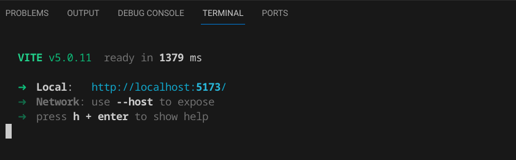

# Front-end and Back-end Deployment
<div style="text-align: right">

[Back](README.md)
</div>

## Starting Front-end and Back-end modules

<details>
<summary style="font-size:23px;">Launching the back-end locally</summary>

### Launching the back-end locally

1. Navigate to the `py-backend-api` directory:
   ```bash
   cd py-backend-api
   ```

2. Create environment: 

- Use Python 3.10 (recommended using `pyenv` to install and manage Python versions)

   ```bash
   python3 -m venv venv
   ```
   ```bash
   source venv/bin/activate
   ```

3. Install the necessary dependencies:
   ```bash
   pip install -r requirements.txt
   ```
4. Run the Backend server locally:
   ```bash
   flask run
   ```
   OR
   ```bash
   python app.py
   ````
   OR
   ```bash
   flask --app app.py run
   ````

   By default, the app will be running on [http://localhost:5000/](http://localhost:5000/).

5. The backend local launch will look like below

   


</details>

<details>
<summary style="font-size:23px;">Launching the front-end locally</summary>

### Launching the front-end locally

Follow these steps to start the development server on your local machine:

1. Navigate to the `webapp` directory:

   ```bash
   cd webapp
   ```
2. Install the necessary dependencies:
   ```bash
   npm 
   ```

3. Ensure the .env.development file is updated with the API endpoints (either local / deployed on App Engine / other) for the following two keys

   ```
   VITE_PUBLIC_QA_API_ENPOINT_1=http://127.0.0.1:5000/api/sqlgen
   VITE_PUBLIC_QA_API_ENPOINT_2=http://127.0.0.1:5000/api/display
   ```
   Value shown above is that of API endpoint running locally. This can be pointed to other endpoints depending on the deployment

4. Run the UI server locally:
   ```bash
   npm run dev
   ```
   By default, the app will be running on [http://localhost:5173/](http://localhost:5173/).

5. Local front-end development server run will be as shown

   
</details>

## Deploying the Application on App Engine

<details>
<summary style="font-size:23px;">Deploying the Back-end service</summary>

### Deploying Back-end service

To deploy the application on App Engine, ensure you follow these prerequisites and steps:

1. **Permissions**: Make sure you have the required IAM permissions before deploying the app.

2. **Update `app.yaml`**: If necessary, update the `app.yaml` file in the `py-backend-api` directory to reflect any specific deployment configurations.

3. **Project ID**: Set the project ID.
    ```
    gcloud config set project [PROJECT_ID]
    ```
4. Deploy the app on App Engine:
   ```bash
   gcloud app deploy
   ```
5. Use below command to get/launch the deployed app url. For example
    ```bash
    gcloud app browse --service <servicename>
    ```

Note the URL deployed in the App Engine dashboard for the backend service.  This is needed to update the API endpoint in the front-end application

</details>

<details>
<summary style="font-size:23px;">Deploying the front-end service</summary>

### Deploying Front-end service

To deploy the webapp application on App Engine, ensure you follow these prerequisites and steps:

1. **Permissions**: Make sure you have the required IAM permissions before deploying the app.

2. **Update `app.yaml`**: If necessary, update the `app.yaml` file in the `webapp` directory to reflect any specific deployment configurations.

3. **Project ID**: Verify that the deploy command in `package.json` is pointing to the correct project ID.

4. Update **.env.production** file with the API endpoints of the backend service.  Following keys needs to be updated

   ```
   VITE_PUBLIC_QA_API_ENPOINT_1=*appengine backend service endpoint*/**api/sqlgen**
   VITE_PUBLIC_QA_API_ENPOINT_2=*appengine backend service endpoint*/**api/display**
   ```

5. Deploy the app on App Engine:
   ```bash
   npm run deploy
   ```

6. Use below command to get/launch the deployed app url. For example
    ```bash
    gcloud app browse --service <webapp>
    ```
    <webapp> is the deployed service name

</details>